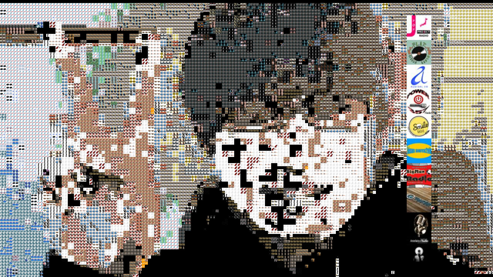
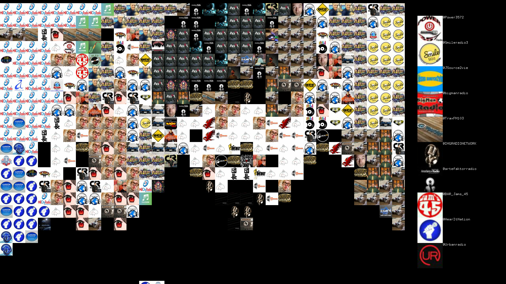

# Photo-mosaic-in-Real-time
Photo mosaic from twitter icon in real-time.

## Example
+ Capture Image (Icon Size:Small)

+ Capture Image (Icon Size:Large)

+ [Movie](https://twitter.com/tkysmrst/status/1086898154367152128)
## Requirement
+ Web Camera
+ openframeworks
  - [ofxJSON](https://github.com/jeffcrouse/ofxJSON)
  - [ofxPostGlitch](https://github.com/maxillacult/ofxPostGlitch)
+ Node.js
  - twit
+ Twitter API key and token

## Installation
Clone this repository  below your openframeworks apps directory.

## Usage
1. Get Twitter API key and token from [Twitter Developer Platform](https://developer.twitter.com/)
2. Enter your key and token in **stream.js**
```js
consumer_key: 'ABCDEFGHIJKLMNOPQRSTUVWXYZ0123456789',
consumer_secret: 'ABCDEFGHIJKLMNOPQRSTUVWXYZ0123456789',
access_token: 'ABCDEFGHIJKLMNOPQRSTUVWXYZ0123456789',
access_token_secret: 'ABCDEFGHIJKLMNOPQRSTUVWXYZ0123456789'
```
3. Enter Keyword or hashtag in **stream.js**
```js
var stream = T.stream('statuses/filter', {track:'ABCDE'});
```
4. Run **stream.js**
5. Build openframeworks project
